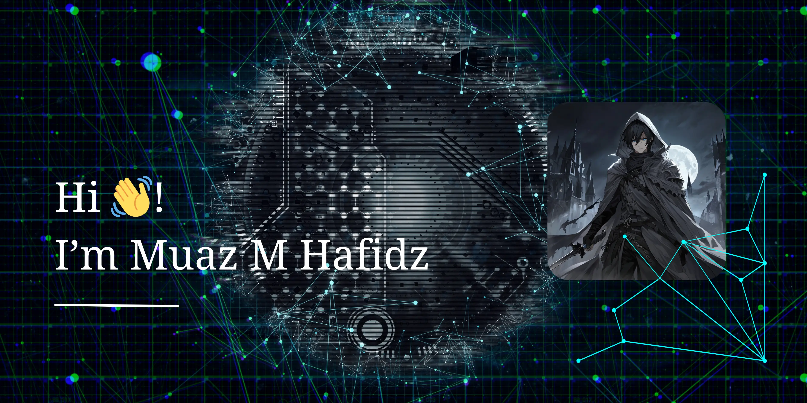

## 👋 Hi, I'm Muaz M. Hafidz!

I'm a backend developer with a passion for building intelligent, secure, and scalable web applications. I enjoy working with modern technologies, exploring AI/ML, and improving systems that make real impact.

---

### 🚀 Tech Stack & Tools

  
  
  
  
  
  
  
  
  
  
  
  
  
  
  
  
  
  
  
  
  
  
  
  
  
  
  
  
  
  
  
  
  
  
  
  
  
  
  
  
  
  
  
  
  
  
  
  
  
  
  
  
  
  
  
  
  
  
  
  
  
  
  
  
  
  
  
  
  
  
  
  
  
  
  
  
  
  
  
  
  
  
  
  
  
  
  
  
  
  
  
  
  

---

### 📈 GitHub Stats

  
  

---

### 💡 A Bit More About Me

- 🧠 Currently exploring the world of Machine Learning, data-driven systems, and intelligent automation
- 🛠️ Passionate about developing APIs, backend systems, and working across the full stack Development.
- ✍️ I enjoy sharing my learning and continuous collaboration

---

### 📫 Let's Connect

---

<picture>
  <source media="(prefers-color-scheme: dark)" srcset="https://raw.githubusercontent.com/MUAZMHAFIDZ/MUAZMHAFIDZ/output/pacman-contribution-graph-dark.svg">
  <source media="(prefers-color-scheme: light)" srcset="https://raw.githubusercontent.com/MUAZMHAFIDZ/MUAZMHAFIDZ/output/pacman-contribution-graph.svg">
  
</picture>

###

<!-- > "Code is like humor. When you have to explain it, it’s bad." – Cory House -->

<!--
**MUAZMHAFIDZ/MUAZMHAFIDZ** is a ✨ _special_ ✨ repository because its `README.md` (this file) appears on your GitHub profile.

Here are some ideas to get you started:

- 🔭 I’m currently working on ...
- 🌱 I’m currently learning ...
- 👯 I’m looking to collaborate on ...
- 🤔 I’m looking for help with ...
- 💬 Ask me about ...
- 📫 How to reach me: ...
- 😄 Pronouns: ...
- ⚡ Fun fact: ...
-->
